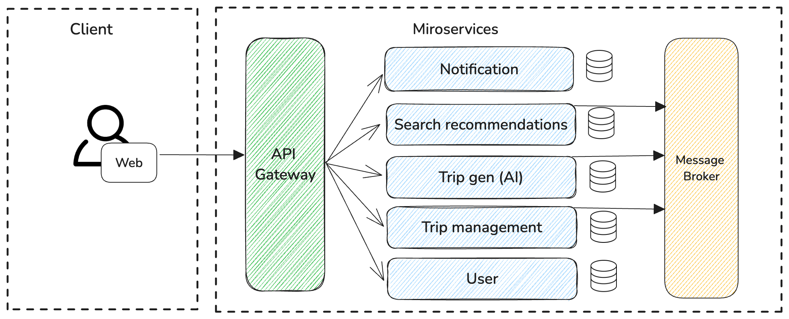

# AI Trip Planner

## How to Run the Project

Follow the steps below to run the project locally:

1. Clone the project repository:
   ```bash
   git clone https://github.com/ch0min/ai-trip-app.git
   ```
2. Start Docker Desktop.
3. Navigate to the `/server` directory and run the following command to start the database:
   ```bash
   docker-compose up -d
   ```
4. Navigate to the root directory of the project and start the server:
   ```bash
   go run main.go
   ```
5. To run the frontend (React):
   - Navigate to the `/client` directory:
     ```bash
     cd client
     ```
   - Install dependencies:
     ```bash
     npm install
     ```
   - Start the frontend:
     ```bash
     npm start
     ```

## Architecture

The AI Trip Planner follows a client-server architecture where:

- **Frontend**: React + TypeScript.
  The user interface communicates with the backend through API requests.


_First iteration of the architecture diagram_

- **Backend**: Golang-based microservices.
  The backend handles user authentication, trip generation, search and recommendations, and notifications.

- **API Gateway**: Serves as the entry point for all API requests, routing them to the correct backend services.

- **Database**: PostgreSQL is used for data persistence across the services.

## API Endpoints Documentation

- **User Service**
- **Trip Generation Service**
- **Notification Service**
